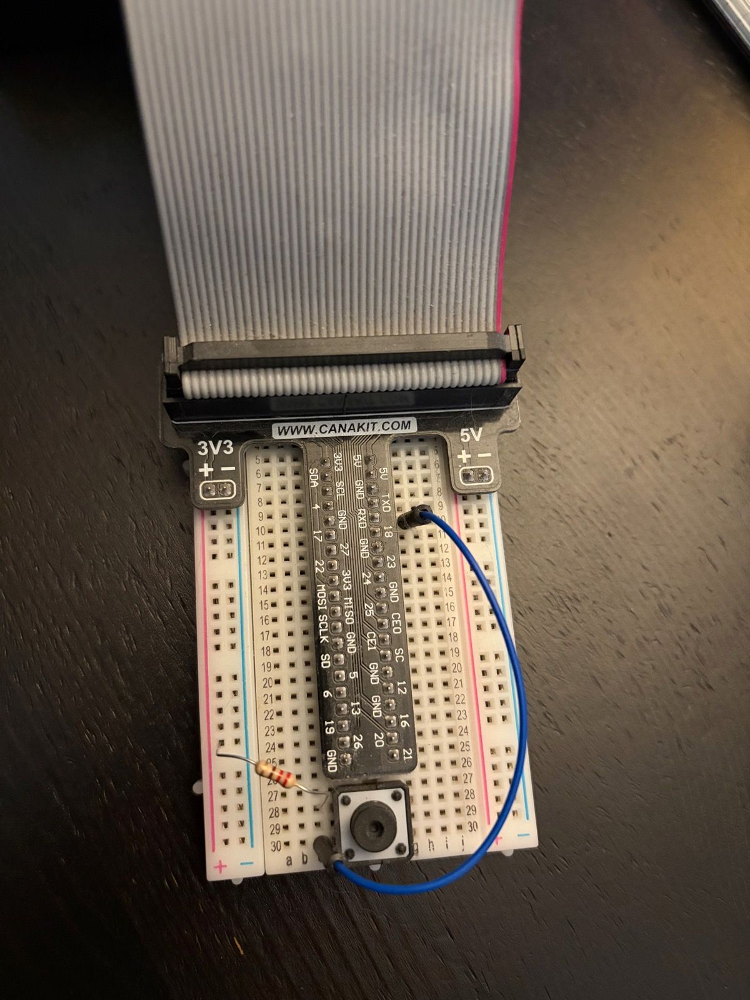

# rpi-pushbutton (BP Meds Tracker)

A Raspberry Pi pushbutton that logs a timestamp to a Google Sheet whenever it's
pressed, and posts a log message to Slack. Originally built to track when
blood pressure medication was taken — press the button, the event is recorded.

## How it works

`track_meds.py` uses [gpiozero](https://gpiozero.readthedocs.io/) to watch a
GPIO pin wired to a pushbutton. On each press it appends a row (date + time)
to a Google Sheet via `gspread`, and writes a line to a local log file
(`bpstatstracker.log`), which is also relayed to a Slack channel through an
incoming webhook.

`start_tracker.sh` activates the project's virtualenv and launches the
tracker in the background; it's meant to be run at boot (e.g. via `cron
@reboot` or a systemd service) from `/home/pi/repos/bpstatstracker`.

## Hardware

- Raspberry Pi (any model with a 40-pin GPIO header)
- Breadboard
- Momentary pushbutton
- 220 Ω resistor (5% tolerance — color bands: red, red, brown, gold)
- Jumper wires

### Breadboard layout

The breadboard sits under the Pi's GPIO header, oriented with the 3V3
power rails on the left and the 5V power rails on the right, and the GPIO
signal pins running down the center. The board has 30 numbered rows and 10
lettered columns (`a`–`j`) between the two rail columns.

```
 3V3 +/-                 GPIO pins                  5V +/-
   |   |         a  b  c  d  e  f  g  h  i  j          |   |
   |   |   27    .  .  [R]-+--+  .  .  .  .             |   |   <- resistor: 27c -> 3V3+
   |   |   28    .  .  .  |  |  .  .  .  .             |   |
   |   |   29    .  .  .  |  |  .  .  .  .             |   |       button legs span
   |   |   30    .  .  +--+--+  .  [J]--+  .             |   |   <- jumper: 30c -> 10h
   |   |                                |
   |   |   10    .  .  .  .  .  .  .  X  .  .             |   |   <- RXD (GPIO15 / physical pin 10)
```



- **Pushbutton**: seated across rows 27–30, columns d–g, straddling the
  board's center gutter so its four legs land on independent nodes.
- **Pull-up resistor (220 Ω, red-red-brown-gold)**: runs from row 27,
  column c to the **3V3+** rail. This ties one side of the button to 3.3 V
  through the resistor.
- **Signal jumper**: runs from row 30, column c to row 10, column h. Row 10
  lines up with the pin labeled **RXD** on the GPIO breakout — physical pin
  10 on the 40-pin header, which is BCM `GPIO15`. This is the pin
  `track_meds.py` reads via `Button(15, pull_up=False)`.

With the internal pull-down enabled in software (`pull_up=False`), the GPIO
pin normally reads low. Pressing the button bridges rows 27 and 30, pulling
GPIO15 high through the 220 Ω resistor from 3V3, which `gpiozero` reports as
a press.

## Software setup

```bash
python3 -m venv venv
source venv/bin/activate
pip install gpiozero gspread oauth2client slack_sdk
```

Two config files (both git-ignored) are expected alongside `track_meds.py`:

- `blood-pressure-stats-3437e823e42b.json` — Google service account
  credentials with access to the target Google Sheet.
- `slack-config.json` — `{"logs_url": "<slack incoming webhook URL>"}`

The Google Sheet itself is expected to be named `BP Meds Taken` and shared
with the service account's email.

## Running

```bash
./start_tracker.sh
```

This activates the venv and runs `track_meds.py` in the background, which
waits indefinitely for button presses.
